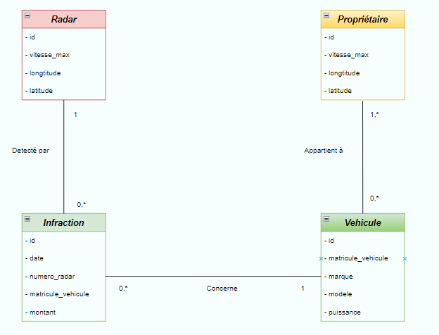

# Radar Violation Management System - Architecture and Development

The project aims to create a distributed system based on microservices to manage and automate the process of violations related to speed exceeding detected by automatic radars. The system consists of three microservices: the Radar Management microservice, the Vehicle Registration microservice, and the Violation Management microservice. The goal is to efficiently manage radars, vehicles, and violations, as well as provide owners with the ability to view their violations.

# Table of Contents
- [Technical Architecture](#technical-architecture)
- [Class Diagram](#class-diagram)
- [Backend Services](#backend-services)
    - [Immatriculation Service](#regestration-service)
    - [Radar Service](#radar-service)
    - [Infraction Service](#infraction-service)
    - [Eureka Discovery Service](#eureka-discovery-service)
    - [Gateway Service](#gateway-service)
    - [Radar Device](#road-radar)
- [Frontend with Angular](#frontend-with-angular)

## Technical Architecture

## Class Diagram

## Backend Services

The backend contains 5 services :

### Immatriculation Service

The Immatriculation microservice manages owners and vehicles. It uses JPA entities and a JpaRepository interface based on Spring Data for data persistence. The microservice exposes 4 web services: REST, GraphQL, SOAP, and gRPC, to allow for data querying and modification. Tests are conducted to ensure the proper functioning of the 4 web services.

`Service Structure`

- Web services : REST, GraphQL, SOAP and GRPC :

> REST

Tests with `Browser`

<table>
    <tr>
        <td >
            <h5 align="center">All Vehicles</h3>
                

                    
                

        </td>
    </tr>
    <tr>
        <td >
            <h5 align="center">Find Vehicle By Id</h3>
                

                    
                

        </td>
    </tr>
</table>

Tests with `Postman`

<table>
    <tr>
        <td >
            <h5 align="center">Modify Vehicule</h3>
                

                    
                

        </td>
    </tr>
</table>

> GraphQL 
<table>
    <tr>
        <td>
            <h5 align="center">Find Vehicule By ID</h3>
                

                    
                

        </td>
    </tr>
    <tr>
        <td>
            <h5 align="center">Delete Vehicule</h3>
                

                    
                

        </td>
    </tr>
</table>

> SOAP :

The generated `WSDL` file 
<table>
    <tr>
        <td >
            <h5 align="center">WSDL</h3>
                

                    
                

        </td>
    </tr>
</table>

Tests with `SoapUI`
<table>
    <tr>
        <td >
            <h5 align="center">Get Owner by ID </h3>
                

                    
                

        </td>
    </tr>
</table>

> GRPC :

Tests with `BloomRPC`
<table>
    <tr>
        <td>
            <h5 align="center">All Owners </h3>
                

                    
                

        </td>
    </tr>
</table>

####

### Radar Service

The Radar Microservice is responsible for managing radar entities within the system. It handles the following information for each radar:
<ul>
<li>Radar ID: A unique identifier for each radar.</li>
<li>Maximum Speed Limit: The maximum allowable speed for vehicles passing through the radar's monitoring area.</li>
<li>Coordinates: The geographical coordinates (longitude and latitude) of the radar's location.</li>
</ul>

`Service Structure`

### Infraction Service

The Infraction Microservice is responsible for managing violations within the system. It handles the following information for each violation:

<ul>
<li>Violation ID: A unique identifier for each violation.</li>
<li>Date: The date when the violation occurred.</li>
<li>Radar Number: The identification number of the radar that detected the offense.</li>
<li>Vehicle Registration Number: The registration number of the vehicle involved in the violation.</li>
<li>Vehicle Speed: The speed at which the vehicle was traveling during the violation.</li>
<li>Radar's Maximum Speed Limit: The maximum speed limit set by the radar.</li>
<li>Fine Amount: The amount of fine imposed for the violation.</li>
</ul>

`Service Structure`

### Eureka Discovery Service

server-side component in the Netflix OSS stack that allows services to register
and discover each other in a microservices architecture.

`Service Structure`

### Gateway Service

Spring Cloud Gateway It provides a centralized entry point for routing and filtering requests
to microservices in a distributed system, enabling dynamic and scalable routing based on various criteria.

`Service Structure`

### Radar Device

A Java application that simulates a radar system generating random speeding violations
and sending them to the Radar-Service.

`Service Structure`

# Frontend with Angular

<table>
    <tr>
        <td >
            

                <h5 align="center">Login Page</h3>
                
            

        </td>
    </tr>
    <tr>
        <td >
            

                <h5 align="center">Dashbord page</h3>
                
            

        </td>
    </tr>

</table>

<table>
    <tr>
        <td >
            

                <h5 align="center">List of radars</h3>
                
            

        </td>
    </tr>
    <tr>
        <td >
            

                <h5 align="center">Add radar</h3>
                
            

        </td>
    </tr>
    <tr>
        <td >
            

                <h5 align="center">Edit radar</h3>
                
            

        </td>
    </tr>
</table>

<table>
    <tr>
        <td >
            

                <h5 align="center">List of infractions</h3>
                
            

        </td>
    </tr>
</table>

<a href="https://github.com/Hanif-Ayoub/Projet_Control/captures/RAPPORT_CONTROLE.pdf">`Click here to see the report`</a>